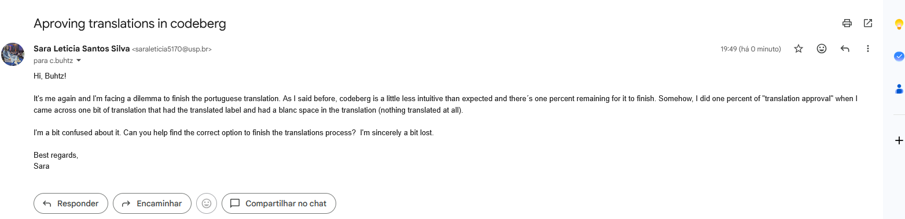
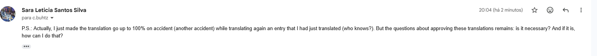

# Dia 20/09/2026
### Projeto: Back in Time
### Plataforma de Tradução: Weblate no Codeberg

Nesta semana de atividades na disciplina, foram realizadas 16 traduções no weblate no Codeberg e 1 aprovação de conteúdo traduzido, que ainda preciso entender exatamente como funciona para que o projeto de tradução do idioma no portugês cheque em 100%, devido ao fato de outros voluntários terem colaborado durante a semana e terem rapidamente suprido as traduções restantes do site. Entre os pontos mais importante, foi que houveram traduções de palavras técnicas para o modo _somente leitura_ do _Back in Time_, como o termo "Udev" e "UUID", o que não foi fácil considerando o público alvo não técnico.

Ademais, realizei leitura minuciosa sobre o README.md para entender mais sobre os mantenedores de código e me surpreendi pela tamanha falta de apoio a trabalhos tão importantes de manutenção e atualização de softwares já integrados à muitas distros de Linux. Apenas o Buhtz atualmente está ativo na colaboração co código, o que me surpreendeu bastante. Mas existem pontos de organização muito interessantes, já que os mantenedores fazem um registros de problemas e bugs que nov
os colaboradores podem atuar para resolver.

Encontrei um problema para chegar em 99% absoluto na completude do projeto de tradução, que mostra apenas 99% do total. No entando, presumi que isso fosse devido a uma falta de aprovações de traduções dos gerenciadores do projeto de tradução (um dele seria eu), mas devido à falta de clareza da plataforma, somente realizei 1% dessa aprovação (por acidente). Enviei um e-mail a Buhtz para esclarecer o que realmente falta nesse 1% apontado pelo Weblate no Codeberg, como pode ser visto abaixo:

 

No entanto, ao retraduzir os trechos que eu havia traduzido por último, a porcentagem de tradução subiu para 100%, curiosamente, então mandei outro e-mail dizendo que um dos problemas haviam sido solucionados mas eu ainda gostaria de entender como aprovar as traduções (imagino que seja uma espécie de revisão do site).

Depois de algumas frustrações com as traduções da própria aplicação, continuei a pensar em formas de tornar o projeto acessível para programadores brasileiros e decidi traduzir documentações e instruções dos mantenedores para desenvolvedores brasileiros. Minha ideia é disponibilizar um fork inicial com os mesmos arquivos de código, alterando somente as traduções de arquivos mesmo. Iniciei traduzindo o arquivo README.md, disponibilizando tudo em um fork numa branch separada para facilitar todo o processo posterior de tradução caso novas alterações documentais sejam feitas. [Nesse link](https://github.com/Sara-L-S-Silva/backintime_portugu-s_br/tree/pt-br) é possível acessar a branch exata do fork que fiz do projeto utilizada par tradução de arquivos.

Mantive nomes próprios, comandos e outros pormenores em inglês para não gerar confusões, mas ainda estou no processo de terminar o contributing.md. Fazer tudo na mão e colocar a formatação exatamente igual leva mais tempo do que eu esperava.

## Próximos passos

Pretendo fazer posteriores tentativas de algo em python para ajudar em testes e bugs dependendo do quão complexo for, mas não garanto que seja versada em Linux o suficiente para isso. Como primeiro passo, pretendo analisar as issues e bugs para entender do que o projeto precisa no momento e o que pode ser mais facilmente aprendido. Após isso,

## Considerações

Considerando pormenores do projeto, sinto que posso contribuir considerávelmente para a comunidade ao traduzir esse repositório, acredito que uma divulgação também possa ser interessante para que mais pessoas se interessem por ele. Uma das minhas tarefas atuais é pensar em uma forma produtiva de divulgá-los nos stories do meu instagram no final das minhas contribuições, tanto para doações quanto para atuação no código em si.

Resumo de links:

* [Site de tradução](https://codeberg.org).
* [Github do Back In Time](https://github.com/bit-team/backintime).
* [Comentário específico disponível nessen link com a respota de Buhtz](https://translate.codeberg.org/translate/backintime/common/pt_BR/?checksum=5369b3929d2073e0&q=state%3A%3Ctranslated&sort_by=component%2C-priority).
* [Minhas 16 traduções estão disponíveis nesse site](https://translate.codeberg.org/memory/).

Todas as imagens de diários estão disponíveis na pasta "imagens". Ao final do semestre, será realizado um README contando sobre o projeto da disciplina de forma mais abrangente.